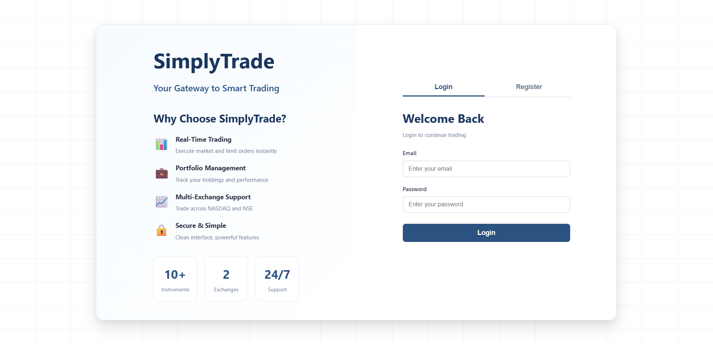
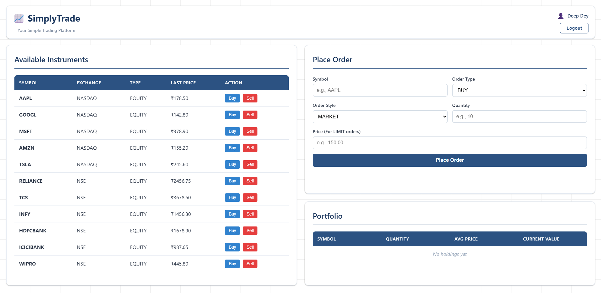
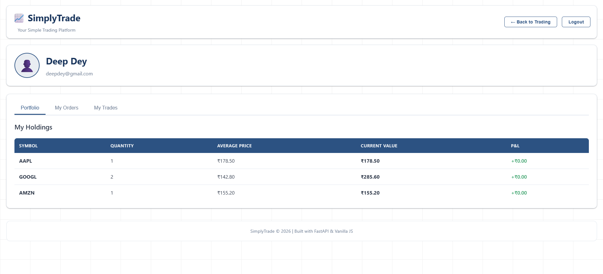

# SimplyTrade 📈

A modern, intuitive trading platform built with FastAPI and vanilla JavaScript, designed for seamless equity trading across NASDAQ and NSE exchanges.

## Overview

SimplyTrade is a full-stack web application that provides a streamlined trading experience with real-time order execution, portfolio management, and comprehensive trade tracking. The platform supports both market and limit orders, enabling users to execute trades efficiently while maintaining a clear view of their positions and performance.

### Landing Page and User Authentication


### Trading Dashboard


### User Portfolio and Trading History


## Features

### Core Trading Functionality
- **Multi-Exchange Support** - Trade equities across NASDAQ and NSE markets
- **Order Types** - Execute market orders for instant execution or limit orders at specific prices
- **Real-Time Execution** - Market orders are automatically matched and executed
- **Portfolio Tracking** - Monitor holdings with real-time average price calculations
- **Trade History** - Complete audit trail of all executed transactions

### User Experience
- **User Authentication** - Secure registration and login system
- **Personal Dashboard** - Consolidated view of instruments, orders, portfolio, and trades
- **Profile Management** - Dedicated profile page with performance analytics
- **Profit/Loss Tracking** - Visual indicators for portfolio performance
- **Responsive Design** - Professional UI with grid backgrounds and radial gradients

## Technology Stack

### Backend
- **FastAPI** - High-performance Python web framework
- **SQLAlchemy** - ORM for database operations
- **SQLite** - Lightweight relational database
- **Uvicorn** - ASGI server for production deployment
- **Pydantic** - Data validation and settings management

### Frontend
- **Vanilla JavaScript** - No framework dependencies for optimal performance
- **Modern CSS3** - Custom styling with flexbox and grid layouts
- **HTML5** - Semantic markup for accessibility

## Architecture

### API Design
RESTful API with clear separation of concerns:
- **Authentication Layer** - User registration and login endpoints
- **Trading Engine** - Order placement and execution logic
- **Data Access Layer** - CRUD operations for instruments, orders, and trades
- **Session Management** - Header-based user identification

### Database Schema
- **Users** - Account information and credentials
- **Instruments** - Available securities with current prices
- **Orders** - Buy/sell requests with status tracking
- **Trades** - Executed transactions with timestamps
- **Portfolio** - User holdings with average prices

### Data Flow
```
User → Frontend → API Endpoints → Business Logic → Database
                                ↓
                         Order Execution
                                ↓
                    Portfolio Update + Trade Record
```

## API Endpoints

### Authentication
- `POST /api/v1/auth/register` - Create new user account
- `POST /api/v1/auth/login` - Authenticate user

### Trading Operations
- `GET /api/v1/instruments` - List available securities
- `POST /api/v1/orders` - Place new order
- `GET /api/v1/orders` - Retrieve user's orders
- `GET /api/v1/trades` - Fetch executed trades
- `GET /api/v1/portfolio` - View current holdings

## Local Development

### Prerequisites
- Python 3.12+
- pip package manager

### Setup
```bash
# Install dependencies
pip install -r requirements.txt

# Start backend server
cd backend
uvicorn main:app --reload

# Open frontend (any static server)
cd frontend
python -m http.server 8080
```

The application will be available at `http://localhost:8080`

## Project Structure

```
SimplyTrade/
├── backend/
│   ├── main.py           # FastAPI application and routes
│   ├── models.py         # SQLAlchemy models
│   ├── database.py       # Database configuration
│   └── requirements.txt  # Python dependencies
├── frontend/
│   ├── index.html        # Main trading dashboard
│   ├── landing.html      # Login/registration page
│   ├── profile.html      # User profile page
│   ├── script.js         # Dashboard functionality
│   ├── styles.css        # Main stylesheet
│   └── ...
└── public/               # Production build directory
```

## Key Implementation Details

### Order Execution Logic
- Market orders execute immediately at the last traded price
- Limit orders remain pending until manually fulfilled
- Each execution creates a trade record and updates the portfolio
- Average price is recalculated on each buy transaction

### Security Features
- Email-based user identification
- Password storage (production deployments should use hashing)
- User-specific data isolation via headers
- CORS enabled for cross-origin requests

### Performance Optimizations
- Lightweight vanilla JavaScript (no framework overhead)
- Single-page application architecture
- Efficient database queries with SQLAlchemy
- Static file serving for optimal load times

## Sample Instruments

The platform comes pre-populated with diverse equities:

**NASDAQ:** AAPL, GOOGL, MSFT, AMZN, TSLA  
**NSE:** RELIANCE, TCS, INFY, HDFCBANK, ICICIBANK, WIPRO

## Future Enhancements

Potential features for production deployment:
- WebSocket integration for real-time price updates
- Advanced charting with historical data
- Order modification and cancellation
- Multiple portfolio support
- Advanced analytics and reporting
- Two-factor authentication
- Password hashing with bcrypt
- Rate limiting and API security

---

**Built with ❤️ for modern trading**
